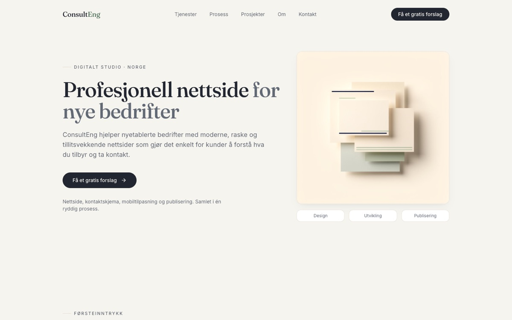

# ConsultEng

Nettsiden til ConsultEng, et lite webstudio jeg driver alene, som lager profesjonelle nettsider for nyetablerte bedrifter.

**Live:** [consulteng.no](https://consulteng.no)



## Innhold

Siden er én side med disse seksjonene:

- **Hero** – hva studioet tilbyr, med en knapp til kontaktskjemaet
- **Problem og målgruppe** – hvorfor nye bedrifter trenger en nettside, og hvem tjenesten passer for
- **Tjenester** – design, mobilvennlighet, tekststruktur, kontaktskjema og grunnleggende SEO
- **Prosess** – fire steg fra kartlegging til publisert nettside
- **Prosjekter** – DigiSaga og en anbudsplattform
- **Om meg** og **kontakt**

## Teknologi

React, TypeScript, Vite og Tailwind CSS. Kontaktskjemaet validerer feltene med zod og sender henvendelsen til en Make.com-webhook.

## Kjør lokalt

```bash
npm install
npm run dev
```
